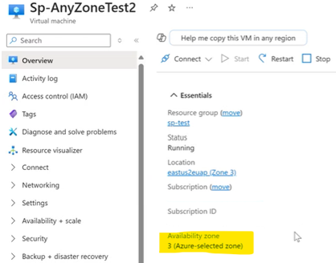

# (PREVIEW) Azure Selected Zone

## Introduction 
Welcome to the onboarding guide for Azure Selected Zone, an exciting new feature in Azure Compute that enables greater flexibility and resilience in your VM deployments. This guide will walk you through the essentials of this feature, highlight its benefits, and provide a step-by-step process on how to utilize it effectively.

## Supportability
- We currently support creating new Disk(s) & IPs along with the VM using [Azure Selected zone via portal](https://github.com/MicrosoftDocs/azure-compute-docs/articles/virtual-machines/create-portal-availability-zone.md). The above capability was previewed in July 2024
- Currently we are previewing Existing Disk(s) & Existing IP attach scenarios with AnyZone VM: [Sign-up here](https://nam06.safelinks.protection.outlook.com/?url=https%3A%2F%2Fforms.microsoft.com%2Fr%2Ff2QnB22Mbt&data=05%7C02%7Csgujjarlapud%40microsoft.com%7C6a8db3e469f148c4902a08dd4cd13a5e%7C72f988bf86f141af91ab2d7cd011db47%7C1%7C0%7C638751183721195381%7CUnknown%7CTWFpbGZsb3d8eyJFbXB0eU1hcGkiOnRydWUsIlYiOiIwLjAuMDAwMCIsIlAiOiJXaW4zMiIsIkFOIjoiTWFpbCIsIldUIjoyfQ%3D%3D%7C0%7C%7C%7C&sdata=e4NdNb5BAU0HgJOVpcYQIkF%2BStBPZ0xjW3gPKiIIXgg%3D&reserved=0)
- **Unsupported scenarios:** PPG, Dedicated Host & Capacity Reservation groups are not supported to be created with an AnyZone VM as of now (they will be included in the future)

## What is Azure Selected Zone?
Azure Selected Zone allows you to create a zonal VM without the overhead of zone selection. VM Create API will accept a new param value zonePlacementPolicy=’any’ during Single Instance VM creation. (Customers don’t have to specify ‘zones’ property with this feature.) This will let Azure pick the most optimal landing zone for the VM during creation, based on multiple infrastructure constraints including compute & storage capacity.
### VM PUT REST API new property:
**Placement Property Sample:**
```json
"placement": {
		"zonePlacementPolicy": "Any",
		"excludeZones": [
			"2"
		]
		"includeZones": [
			"1","3"
		]
	}
```
**Description of Placement Property:**
- zonePlacementPolicy (required): will accept the value “any” indicating Azure will pick the most optimal zone to create the zonal VM
- ExcludeZones (optional): to specify if any particular zone(s) need to be avoided while Azure selects the landing zone for the VM
- IncludeZones (optional): to specify if any sub-set of zone(s) ONLY need to be used while Azure selects the landing zone for the VM
> [!NOTE]
 > - Only one of the zone='n' or zonePlacementPolicy can be provided at a time during VM create. If both are provided at the same time, an error will be thrown.
 > - Only one of includeZones/excludeZones can be provided at a time. If both are provided at the same time, an error will be thrown.
 > - The scope of this Private Preview allows SI VM creation via REST API or ARM template in EastUS2EUAP region

## Benefits of Azure Selected Zone
This will improve customers’ zonal deployment experience in comparison to current explicit selection of zone (1/2/3). Azure will attempt to select the most optimal zone and aid in improved zonal VM allocation success rate! 

## Creating VM using Azure Selected Zone via REST API
### Step 1: Subscription allowlisting
Get your intended Azure Subscription that will be used for preview to be allowlisted by the Product PoCs below (if not already). Or fill [this form](https://nam06.safelinks.protection.outlook.com/?url=https%3A%2F%2Fforms.microsoft.com%2Fr%2Ff2QnB22Mbt&data=05%7C02%7Csgujjarlapud%40microsoft.com%7C6a8db3e469f148c4902a08dd4cd13a5e%7C72f988bf86f141af91ab2d7cd011db47%7C1%7C0%7C638751183721195381%7CUnknown%7CTWFpbGZsb3d8eyJFbXB0eU1hcGkiOnRydWUsIlYiOiIwLjAuMDAwMCIsIlAiOiJXaW4zMiIsIkFOIjoiTWFpbCIsIldUIjoyfQ%3D%3D%7C0%7C%7C%7C&sdata=e4NdNb5BAU0HgJOVpcYQIkF%2BStBPZ0xjW3gPKiIIXgg%3D&reserved=0) & the team will get back in 1-2 business days.
> [!NOTE]
> Contact: asz-support@microsoft.com for allowlisting assistance
### Step 2: Create a Network Interface
In the Azure portal, select "Network Interface" resource create. Provide the following details:
-	Subscription: Whitelisted Subscription
-	Resource Group: Create New (preferably) & note this for later steps
-	Region: East US2 EUAP
-	Name: Give any name and note this for later steps
Review & create the Network Interface
Network Interface can also be created API, PowerShell, CLI by following [Create Network Interface](https://learn.microsoft.com/en-us/azure/virtual-network/virtual-network-network-interface?tabs=azure-portal#create-a-network-interface)
### Step 3: Create a Managed Disk
In the Azure portal, select "Managed Disks" resource create. Provide the following details:
•	Subscription: Whitelisted Subscription
•	Resource Group: Same resource group that is used for Network Interface creation
•	Name: Give any name and note this for later steps
•	Region: East US2 EUAP
•	Availability Zone: No infrastructure redundancy required (create regional disk to get the best validation for Azure Selected Zone VM)
Review & create the Managed Disk
Managed Disk can also be created API, PowerShell, CLI by following [Overview of Azure Disk Storage - Azure Virtual Machines | Microsoft Learn](https://learn.microsoft.com/en-us/azure/virtual-machines/managed-disks-overview)
### Step 4: Create VM using Azure Selected Zone via REST API call
- PUT Request latest API URI: (make edits where the URI is **{bold}**)
```log
https://management.azure.com/subscriptions/{provideWhitelistedSubIdHERE}/resourceGroups/{provideResourceGroupCreatedInStep2HERE}/providers/Microsoft.Compute/virtualMachines/{GiveAVMNameHERE}?api-version=2024-11-01
```
- Request Body Json Sample: (make edits where **{bold}**)
```json
{
	"name": "{GiveAVMNameHERE}",
	"location": "East US 2 EUAP",
  "placement": {
		"zonePlacementPolicy": "Any",
	},
	"properties": {
		"hardwareProfile": {
			"vmSize": "Standard_DS1_v2"
		},
		"storageProfile": {
			"imageReference": {
				"publisher": "canonical",
				"offer": "0001-com-ubuntu-server-focal",
				"sku": "20_04-lts-gen2",
				"version": "20.04.202405130"
			},
			"osDisk": {
				"createOption": "FromImage",
				"caching": "ReadWrite",
				"managedDisk": {
					"storageAccountType": "Premium_LRS"
				},
				"deleteOption": "Detach",
				"diskSizeGB": 30
			},
			"alignRegionalDisksToVMZone": "true",
			"dataDisks": [
				{
					"lun": 0,
					"name": "{Get Disk Name from the Disk created in Step 3 and paste here}",
					"createOption": "Attach",
					"managedDisk": {
						"id": "{Get Disk ResourceID from the Disk created in Step3 and paste here}"
					}
				},
				{
					"lun": 1,
					"name": "ImplicitAnyZoneDisk",
					"createOption": "Empty",
					"managedDisk": {
						"storageAccountType": "Premium_LRS"
					},
					"deleteOption": "Detach",
					"diskSizeGB": 30
				}
			] 
		},
		"osProfile": {
			"computerName": "{giveNameofChoice}",
			"adminUsername": "{GiveUsernameofChoice}",
			"adminPassword": "{GivePasswordofChoice}"
		},
		"networkProfile": {
			"networkInterfaces": [
				{
					"id": "{Get Network Interface ResourceID from the NIC created in Step2 and paste here} "
				}
			]
		}
	}
}
```
>[!IMPORTANT]
> 			"alignRegionalDisksToVMZone": "true" value MUST be "true". This flag will permanently convert Region Disk to Zonal.
### Step 5: Send the REST API PUT request
- Provide the required authentication token
- Send the REST API request from the API tool
### Step 6: Review the createad VM
After few moments of response preview, verify if the VM was created with the Name provided in the API Call:


## Creating VM using Azure Selected Zone via ARM template
### Step 1: Download the template, parameters & deploy raw files from below: 
1. [template.json](./template.json)
2. [parameters.json](./parameters.json)
3. [deploy.ps1](./deploy.ps1)

### Step 2:  Review the template & parameters files
Template & parameters files are pre-populated with sample values. Please modify as desired. 
### Step 3. Run deploy.ps1 in PowerShell
Upload the files is Cloud Shell is being used. Else store the above files in a location from where the PowerShell commands are run: (make edits where **{bold}**)
``log
Run the script: > .\deploy.ps1 -Location ‘eastus2euap’ -SubscriptionId ‘{WhitelistedSubscriptionID}’ -ResourceGroupName ‘{giveDesiredRGName}’ -TemplateParameterFile ‘parameters.json’ -TemplateFile ‘template.json’ -VirtualMachineName ‘{giveDesiredVMName}’ -VirtualNetworkName ‘{giveDesiredNICName}’
``
### Step 4: Review the created VM
After few moments of response preview, verify if the VM was created with the Name provided in the API Call.


## Troubleshooting
Feel free to reach out to (asz-support@microsoft.com) for any questions & issues

